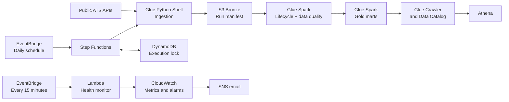

# Job Market AWS Pipeline

A production-oriented data pipeline that collects public job postings, tracks their lifecycle,
and publishes analytics-ready datasets on AWS.

The project focuses on automated ingestion, trustworthy freshness, data quality, and operability.
Its current serving interface is Amazon Athena; dashboard work is intentionally deferred.

## What it delivers

- Daily collection from 36 configured boards across Greenhouse, Lever, Ashby, and Arbeitnow.
- Traceable Bronze data and a committed manifest for every accepted ingestion run.
- Silver lifecycle state with first-seen, last-seen, active, freshness, and status-reason fields.
- Active, fresh, cross-source-deduplicated Gold marts for analysis.
- Seven enforced data-quality checks before Silver is committed.
- Independent freshness and source-coverage monitoring with CloudWatch alarms and SNS.
- Reproducible AWS infrastructure managed with Terraform.

## Architecture



The state machine owns the write path and uses a DynamoDB lock to prevent overlapping writers.
It publishes the pipeline completion marker only after ingestion, Silver quality checks, Gold,
and the crawler have succeeded for the same run.

See [System architecture](docs/architecture.md) for the data contracts, lifecycle semantics,
reliability model, and design decisions.

## Data products

| Layer or mart | Purpose |
| --- | --- |
| Bronze | Immutable per-run source observations and ingestion manifest |
| Silver | Normalized posting identity and lifecycle history |
| `fact_job_posting` | Active, fresh, content-unique postings |
| `demand_by_role` | Posting demand across the configured role families |
| `role_opportunity` | Role rank, demand, remote share, and top hiring company |

Gold is queryable through the `jobmarket_aws_gold` Glue Catalog database in the
`jobmarket-aws` Athena workgroup.

## Deployment

The reference deployment runs in `ap-southeast-1`, with daily ingestion at 01:00 UTC+7 and an
independent health check every 15 minutes. [Acceptance records](docs/evidence/README.md) document
verified runs. Use the [operations runbook](docs/operations.md) to check current health.

## Repository layout

```text
ingestion/   Source connectors, canonical records, and run manifests
glue/jobs/   Bronze-to-Silver lifecycle and Silver-to-Gold transformations
monitoring/  Independent publication-health Lambda
infra/       Terraform for storage, compute, orchestration, IAM, monitoring, and cost controls
scripts/     Read-only operational checks
sql/         Athena inspection and analysis queries
tests/       Ingestion, lifecycle, transformation, freshness, and monitoring tests
docs/        Proposal, architecture, runbooks, results, and evidence
dashboard/   Existing experimental Streamlit serving client; outside the current scope
```

The [documentation map](docs/README.md) explains the responsibility of every document.

## Local development

Use Python 3.11 and Java 17. Local tests mock external APIs and do not require AWS credentials.

```powershell
python -m pip install -r requirements-dev.txt
python -m pytest -q
terraform -chdir=infra init -backend=false
terraform -chdir=infra fmt -check -recursive
terraform -chdir=infra validate
```

To inspect ingestion locally without changing AWS:

```powershell
python -m pip install -r requirements.txt
python ingestion/land_to_bronze.py --out-dir out --limit 3
```

`--limit` is a local smoke-test option. It must not be used as production lifecycle input because
omitted boards would not represent a complete market observation.

## Deploy and operate

Do not start individual Glue stages as a production shortcut. Deploy a reviewed Terraform plan,
then start or allow EventBridge to start the Step Functions state machine.

Exact deployment, verification, recovery, pause, and cleanup procedures are in
[Operations](docs/operations.md). Monitoring behavior and direct AWS inspection are in
[Monitoring](docs/monitoring.md).

## Cost and safety controls

New deployments default to a disabled schedule. Glue limits, S3 retention, an Athena scan cutoff,
and AWS Budget alerts help control usage; a budget alert does not stop spending. See
[architecture](docs/architecture.md) for retention and security boundaries.

Never use `terraform destroy` to recover a failed execution. The lake buckets allow Terraform to
empty them during destruction, so a destroy can remove retained history. Use the recovery and
retirement procedures in the operations runbook.

## Documentation

- [Documentation map](docs/README.md)
- [Project proposal and problem statement](docs/proposal.md)
- [System architecture](docs/architecture.md)
- [Operations runbook](docs/operations.md)
- [Monitoring and AWS inspection](docs/monitoring.md)
- [Verified sample results](docs/sample_results.md)

## License

See [LICENSE](LICENSE).
