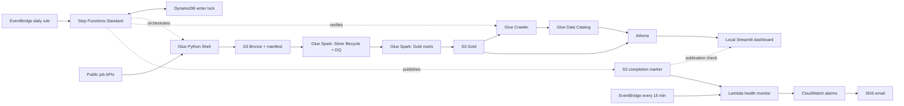

# Job Market AWS Pipeline

**An AWS data engineering workshop: public APIs → a traceable data lake → a queryable dashboard.**

Dự án thực hành pipeline dữ liệu tự động trên AWS: thu thập tin tuyển dụng, chuẩn hóa, theo dõi
vòng đời, kiểm tra độ mới và hiển thị kết quả có thể kiểm chứng. Phạm vi là một mẫu nguồn quốc tế;
không phát triển thành sản phẩm tìm việc cá nhân hay mở rộng crawl thị trường Việt Nam.

[Lab guide / Thực hành](docs/workshop.md) · [Architecture](docs/architecture.md) ·
[Verified results](docs/sample_results.md) · [Documentation map](docs/README.md)

## Problem and outcome

Public job APIs use different schemas and change over time. A successful script alone cannot tell
whether a posting is current, duplicated, missing because of a source failure, or actually closed.
This workshop demonstrates a repeatable daily workflow with observation timestamps, lifecycle,
quality gates, publication checks and independent monitoring.

The result is an inspectable dataset and a simple analytics interface for the **configured sample**.
It does not claim representative market coverage, personal job suitability or employer availability.
See the [proposal](docs/proposal.md) for the bounded problem statement.

## Architecture


```mermaid
flowchart LR
    E[EventBridge daily rule] --> F[Step Functions Standard]
    F <--> L[DynamoDB writer lock]
    F -. orchestrates .-> I[Glue Python Shell]
    A[Public job APIs] --> I
    I --> B[S3 Bronze + manifest]
    B --> S[Glue Spark: Silver lifecycle + DQ]
    S --> G[Glue Spark: Gold marts]
    G --> O[S3 Gold]
    F -. verifies .-> C[Glue Crawler]
    O --> C
    C --> D[Glue Data Catalog]
    O --> Q[Athena]
    D --> Q
    Q --> UI[Local Streamlit dashboard]
    F -. publishes .-> P[S3 completion marker]
    P -. publication check .-> UI
    M[EventBridge every 15 min] --> H[Lambda health monitor]
    P --> H
    H --> CW[CloudWatch alarms]
    CW --> N[SNS email]
```

The workflow publishes completion only after ingestion, Silver checks, Gold and the current crawl
succeed. The dashboard checks the writer lock and matching publication metadata before and after
reading the published partition. Full data/control paths, security boundaries and trade-offs are
in [architecture.md](docs/architecture.md). This Mermaid is an explanatory map; the learner's final
AWS-icon diagram is still to be added here. Save the editable source as
`docs/diagrams/architecture.drawio` and its export as `docs/diagrams/architecture.png`.
Place `` immediately below this Architecture
heading once the file exists; replace or collapse the Mermaid overview to avoid duplicate diagrams.
See the [diagram handoff instructions](docs/workshop.md#architecture-artifact-placement).

Security hardening was deployed on **30 September 2026**: separate stage roles, a restricted
dashboard reader, HTTPS-only bucket access and deliberate cleanup controls. See the
[permission matrix](docs/security-review.md) and [live acceptance](docs/evidence/security-acceptance-20260930.json).

## What is included

- Daily ingestion from **36 configured boards** across Greenhouse, Lever, Ashby and Arbeitnow.
- Bronze observations and manifest; immutable Silver lifecycle state; seven enforced DQ rules.
- Three Parquet Gold marts: `fact_job_posting`, `demand_by_role`, `role_opportunity`.
- Terraform-managed scheduling, orchestration, storage, IAM, monitoring and cost controls.
- One-page dashboard: source/role/location/search filters, posting/company/location counts,
  remote share, role and company charts, and original posting links.
- Bilingual lab guide, operational checks, recovery/cleanup steps and dated AWS evidence.

## Verified reference run

Checked **28 September 2026** in `ap-southeast-1`; these are historical observations, not live status.

| Check | Result |
| --- | --- |
| Schedule | Enabled, daily at 01:00 UTC+7; runs without the laptop |
| Latest three executions | SUCCEEDED |
| Latest UTC snapshot | `2026-09-27` |
| Ingestion | 7,838 observations; 36 successful boards; 0 failed; 1 incomplete |
| Gold | 8,157 unique postings; 467 reported companies; 30.4% marked remote |
| Verification | 67 tests passed; Terraform formatting and validation passed |

[Results and query evidence](docs/sample_results.md) explain why Gold and raw counts differ.
The 01:00 local run belongs to the previous UTC date. Use the
[daily runbook](docs/operations.md#daily-check--kiểm-tra-mỗi-ngày) for today's health.

## Run the dashboard

There are three separate actions:

| Action | Where it runs | When you need it |
| --- | --- | --- |
| Deploy with Terraform | Creates/updates AWS resources | First setup or reviewed infrastructure/code changes |
| Run the pipeline | AWS: EventBridge ? Step Functions ? Glue | Automatically at 01:00 UTC+7; optional manual full execution |
| Open the dashboard | Your computer; reads published AWS data | Whenever you want to inspect results |

**VI:** Stack hi?n t?i ?? deploy v? b?t l?ch. ?? xem d? li?u, ch? m? dashboard; kh?ng c?n
`terraform apply` hay ch?y l?i Glue. T?t m?y kh?ng d?ng l?ch AWS. Dashboard kh?ng crawl d? li?u.

Run PowerShell from the repository root (the folder containing this README, `infra/` and `dashboard/`).
Use an authenticated AWS profile authorized to assume the configured dashboard reader.

One-time local setup (reuse an existing suitable environment if you have one):

```powershell
python -m venv .venv
.\.venv\Scripts\python.exe -m pip install -r dashboard/requirements.txt
```

Each new terminal session:

```powershell
# Optional: set AWS_PROFILE to your existing configured profile; otherwise use default.
# $env:AWS_PROFILE = 'your-profile'
aws sts get-caller-identity
$env:AWS_REGION = 'ap-southeast-1'
$env:LAKE_BUCKET = terraform -chdir=infra output -raw lake_bucket
$env:PIPELINE_LOCK_TABLE = terraform -chdir=infra output -raw pipeline_lock_table
$env:ATHENA_DATABASE = terraform -chdir=infra output -raw gold_database
$env:ATHENA_WORKGROUP = terraform -chdir=infra output -raw athena_workgroup
$env:AWS_DASHBOARD_ROLE_ARN = terraform -chdir=infra output -raw dashboard_reader_role_arn
.\.venv\Scripts\python.exe -m streamlit run dashboard/app.py --server.address 127.0.0.1
```

Open **http://localhost:8501** and press **Refresh data**. Keep the terminal running; `Ctrl+C`
stops only the dashboard. Repeat the environment-variable block after opening a new terminal.
No Java/Spark installation is needed just to view the dashboard.

These `terraform output` commands read the existing deployment state; they do not deploy anything.
A fresh clone does not include private state or AWS credentials. If outputs are unavailable, obtain
these six settings from the existing deployment's operator; do not create another stack just to view it.
If reusing a different venv, substitute its Python executable consistently in both commands.

The reader role must trust your authenticated principal. Missing credentials or an AssumeRole denial
must be resolved through that profile/trust configuration, not by removing the reader restriction.
The page blocks stale or in-progress publication. An idle page does not refresh automatically.
See [daily checks and troubleshooting](docs/operations.md) and [the lab guide](docs/workshop.md)
for new deployments, manual runs, monitoring and cleanup.

## Develop and test

Use **Python 3.11 and Java 17** for the local Spark suite.

```powershell
python -m pip install -r requirements-dev.txt
python -m pytest tests -q
terraform -chdir=infra init -backend=false
terraform -chdir=infra fmt -check -recursive
terraform -chdir=infra validate
```

Tests mock source APIs and AWS clients; local success does not substitute for deployment evidence.

```text
ingestion/    Public API connectors, source catalog and manifest
glue/jobs/    Silver lifecycle, data quality and Gold transformations
infra/        Terraform infrastructure and script uploads
monitoring/   Independent AWS publication-health monitor
dashboard/    Athena reader, display semantics and Streamlit page
scripts/      Operational checks
sql/          Athena inspection and analysis
tests/        Pipeline and dashboard contract tests
docs/         Lab, architecture, runbooks, costs and evidence
```

## Limits and cost

This is a bounded workshop, not a hardened multi-user production service. Arbeitnow pagination is
capped; title-based roles overlap; missing remote metadata does not mean onsite. Gold publication
is not an atomic transaction across marts. Stage-specific roles, an assumed dashboard reader, HTTPS bucket policies and versioning are
managed by Terraform. See the [security review](docs/security-review.md) for remaining boundaries. See [metric definitions](docs/data-dictionary.md).

Daily Glue and supporting AWS services incur charges even when credits offset them. Budget alerts
do not cap spending. Read [cost assumptions and security](docs/cost-and-security.md) and
[cleanup instructions](docs/operations.md#cleanup--kết-thúc-lab) before deployment or retirement.
Destroying this stack can delete retained data.

## Workshop handoff

The implemented pipeline, security changes and local dashboard have passed live acceptance.
The scheduled run on **1 October 2026 at 01:00 UTC+7** also succeeded; see
[the dated handoff check](docs/evidence/handoff-check-20261001.json). Four dashboard PNGs exist in
`docs/screenshots/`; review their framing/dates before embedding them. The learner-verified AWS-icon
diagram, demo video, saved Pricing Calculator estimate and bilingual report website still need
to be supplied before claiming full program submission. See
[the handoff checklist](docs/workshop.md#8-bàn-giao-workshop--submission-boundary).

## License

[MIT](LICENSE).
