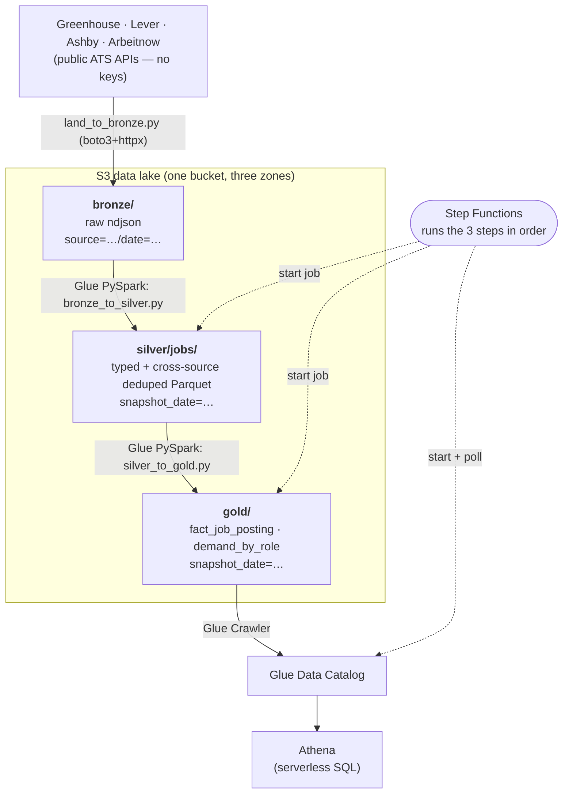

# Architecture — Job Market AWS Pipeline (P2)

A cloud-native rebuild of the **SkillRadar** Medallion pipeline (local DuckDB + dbt + Streamlit)
on AWS, provisioned end-to-end with **Terraform**. Same domain — tech job postings pulled from
public ATS feeds — but the storage, compute, catalog, query and orchestration layers are all
managed AWS services. Building the *same* pipeline two ways is the point: it shows the tradeoffs
between a local lakehouse and a cloud-native one.

## Flow

**Orchestration:** the Step Functions state machine runs `bronze_to_silver` → `silver_to_gold`
(both via the `glue:startJobRun.sync` integration, which blocks until the job finishes) → starts
the Gold crawler and polls `GetCrawler` until it returns `READY`. Everything in the diagram is
defined in `infra/*.tf`.

## Services & IaC

| Layer          | AWS service / resource                                   | Defined in                  |
| -------------- | -------------------------------------------------------- | --------------------------- |
| Storage        | S3 — lake (bronze/silver/gold), athena-results, scripts  | `infra/s3.tf`               |
| Transform      | Glue jobs (PySpark, 2× G.1X, on-demand)                  | `infra/glue.tf`             |
| Catalog        | Glue Data Catalog database + Crawler                     | `infra/glue.tf`             |
| Query          | Athena workgroup (`jobmarket-aws`, 10 GB/query cap)      | `infra/athena.tf`           |
| Orchestration  | Step Functions (Standard) state machine                  | `infra/stepfunctions.tf`    |
| Security       | IAM roles for Glue + Step Functions (least-privilege)    | `infra/iam.tf`              |
| Cost guardrail | AWS Budgets ($10/mo, 80% alert) + S3 lifecycle rules     | `infra/budget.tf`, `s3.tf`  |

## How each AWS piece maps to SkillRadar (local)

| AWS service        | Role here                          | SkillRadar / .NET equivalent     |
| ------------------ | ---------------------------------- | -------------------------------- |
| S3 (zones)         | Bronze/Silver/Gold storage         | local `data/` Parquet + DuckDB   |
| Glue (PySpark)     | Distributed Silver/Gold transform  | dbt models / Python services     |
| Glue Data Catalog  | Table metadata over S3             | DuckDB / MotherDuck schema       |
| Glue Crawler       | Auto-discovers Gold schema         | (dbt knows the schema directly)  |
| Athena             | Serverless SQL over the lake       | DuckDB queries / dbt marts       |
| Step Functions     | Orchestration / DAG                | Prefect flow / Hangfire          |
| Terraform          | Infrastructure as Code             | (new — the headline P2 skill)    |

The domain logic is deliberately a 1:1 port so the two projects are genuinely comparable:

| Logic                        | SkillRadar (Python/dbt)                         | This repo (PySpark)                          |
| ---------------------------- | ----------------------------------------------- | -------------------------------------------- |
| Surrogate key `job_id`       | `dedup.make_job_id` = SHA-256(source\|id)       | `sha2(concat_ws('\|', source, source_job_id))` |
| Cross-source `dedup_hash`    | `dedup.compute_dedup_hash` (upper SHA-256)      | `upper(sha2(concat_ws('\|', norm×3)))`         |
| Normalize key                | `text.normalize_for_key`                        | `norm()` in `bronze_to_silver.py`            |
| Role classification          | `roles.DEFAULT_ROLES` / `seed_roles.csv`        | `DEFAULT_ROLES` in `silver_to_gold.py`       |
| `fact_job_posting`           | dbt `fact_job_posting.sql`                       | dedupe-by-hash in `silver_to_gold.py`        |

## Data model (Gold)

**`fact_job_posting`** — one row per active posting, deduped cross-source by `dedup_hash`
(keep one representative). Grain = `job_id`. Measure = `posting_count = 1`.
Columns: `job_id, dedup_hash, company_key, posted_date_key, first_seen_date_key, source,
board_token, company, title, title_lower, location, is_remote, apply_url, posted_at,
first_seen_at, last_seen_at, posting_count` + partition `snapshot_date`.

**`demand_by_role`** — per target role, count of DISTINCT deduped postings whose title matches
the role's patterns. Columns: `role, job_count` + partition `snapshot_date`.

## Snapshot model (and an MVP simplification)

Each pipeline run produces one `snapshot_date` partition. Unlike the SkillRadar warehouse (which
keeps `first_seen_at` / `is_active` history per posting across runs), this MVP treats every run as
a fresh full snapshot of whatever Bronze currently holds: `first_seen_at = last_seen_at = run time`
and `is_active = true`. Re-running on another day writes a new `snapshot_date` partition, so
`demand_by_role` trends over time without ever mutating prior days. Adding true SCD history is a
natural P2.5 extension.

## Cost

Designed to run on the Free Tier for cents (region `ap-southeast-1`):

- **Glue** is the only real cost: 2× G.1X, 30-min timeout, **on-demand** (no schedule). One run
  over this dataset is a few cents.
- **Athena** = $5/TB scanned; Parquet + `snapshot_date` partitions keep queries < 1¢ and the
  workgroup caps each query at 10 GB.
- **Step Functions** (Standard) is effectively free at this scale.
- **S3 lifecycle** expires raw `bronze/` after 30 days and Athena results after 7 days.
- **AWS Budget** ($10/mo, alert at 80%) is the backstop. No Redshift, no MWAA, no schedule.

## Teardown

It's all IaC — `terraform destroy` from `infra/` removes everything in minutes. The three S3
buckets use `force_destroy = true` so they delete even with objects in them. Recreate any time
with `terraform apply`.

## Screenshots

Athena query results for the portfolio live in [`screenshots/`](screenshots/). Run
[`sql/athena_analysis.sql`](../sql/athena_analysis.sql) in the `jobmarket-aws` workgroup and
capture the leaderboard (query 1), the remote split (query 2), and the source breakdown (query 4).
