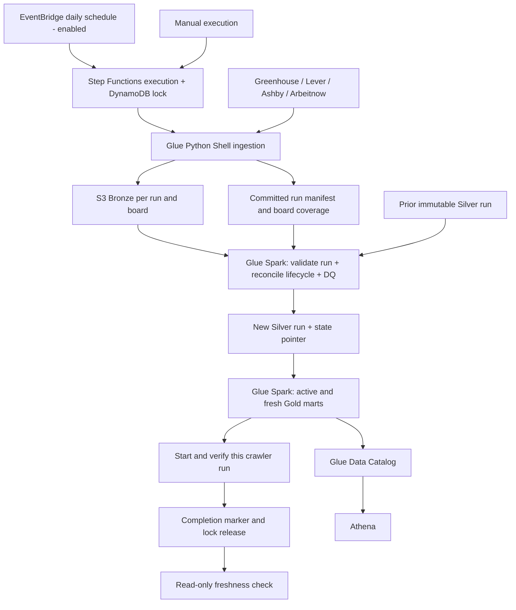

# Architecture — Job Market AWS Pipeline

Deployment observations and operational procedures live in [operations.md](operations.md).
The workflow below was deployed and verified end to end on 2026-09-15. The daily EventBridge
schedule is enabled at 01:00 UTC+7; execution does not depend on a local machine.
The first EventBridge-triggered run succeeded on 2026-09-16 at 01:00–01:07 UTC+7;
[its recorded input and results](evidence/scheduled-run-20260916.json) verify automatic delivery.
Partition dates follow UTC, so that run publishes `snapshot_date=2026-09-15`.

```mermaid
flowchart TD
    EVENT[EventBridge daily schedule - enabled] --> SFN[Step Functions execution + DynamoDB lock]
    MANUAL[Manual execution] --> SFN
    SFN --> INGEST[Glue Python Shell ingestion]
    ATS[Greenhouse / Lever / Ashby / Arbeitnow] --> INGEST
    INGEST --> BRONZE[S3 Bronze per run and board]
    INGEST --> MANIFEST[Committed run manifest and board coverage]
    BRONZE --> SILVER[Glue Spark: validate run + reconcile lifecycle + DQ]
    MANIFEST --> SILVER
    PREVIOUS[Prior immutable Silver run] --> SILVER
    SILVER --> STATE[New Silver run + state pointer]
    STATE --> GOLD[Glue Spark: active and fresh Gold marts]
    GOLD --> CRAWLER[Start and verify this crawler run]
    CRAWLER --> COMPLETE[Completion marker and lock release]
    GOLD --> CATALOG[Glue Data Catalog]
    CATALOG --> ATHENA[Athena]
    COMPLETE --> HEALTH[Read-only freshness check]
```

The execution's run ID and UTC start date are passed to every stage. Ingestion emits one
canonical shape from four APIs, with actual fetch timestamps. Failed boards and incomplete
pagination are separate from a successful empty board. A manifest commits only after all
successful board objects are stored and the configured success threshold is met.

Silver validates the manifest and its exact objects, never scans the historical Bronze root,
and rejects ingestion over 24 hours old. Identity includes source, board and source posting ID;
the content hash still deduplicates cross-source in Gold. Lifecycle compares current observations
with the last committed Silver run: preserve first-seen, refresh last-seen only when observed,
close jobs absent from complete boards, preserve uncertain boards, expire unobserved jobs after
7 days, and reactivate returning jobs without resetting their history.

Gold includes active postings observed within 26 hours of ingestion completion. The three marts
are `fact_job_posting`, `demand_by_role`, and `role_opportunity`; role matching and the Athena
daily-partition layout are retained. Each same-day rerun overwrites the exact partition, even
when empty. Publication across marts is not transactional, so consumers must honor the matching
Silver/pipeline completion markers and the wall-clock freshness check.

One DynamoDB lock serializes all writers; per-job concurrency limits are an additional guard.
Normal failure releases only the owning execution's lock. Aborted/timed-out executions require
confirmation that Glue and crawler activity stopped before a conditional unlock. There is no
automatic lock TTL that might allow overlapping writers.

S3 expires Bronze/manifests after 30 days, quality audits after 90 days, and Athena results/Glue
temp after 7 days. Silver, Gold and state are retained independently, so raw-data expiration
does not destroy lifecycle history. The first new run bootstraps from real current observations;
legacy July Silver timestamps cannot establish historical first/last-seen dates.

## Infrastructure map

| Component | Terraform |
| --- | --- |
| Lake, scripts, results, retention | `infra/s3.tf` |
| Ingestion, source catalog, role, execution lock | `infra/ingestion.tf` |
| Spark jobs, catalog, crawler | `infra/glue.tf` |
| Shared contract and Spark scripts | `infra/scripts_upload.tf` |
| Orchestration and completion marker | `infra/stepfunctions.tf` |
| Permissions | `infra/iam.tf`, `infra/ingestion.tf`, `infra/schedule.tf` |
| Opt-in schedule | `infra/schedule.tf` |
| Query and budget controls | `infra/athena.tf`, `infra/budget.tf` |

The event schedule remains disabled by default. The existing dashboard is outside this work.
