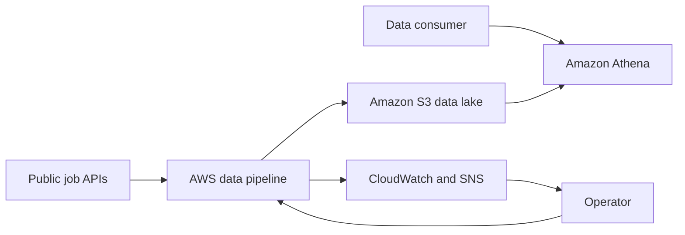
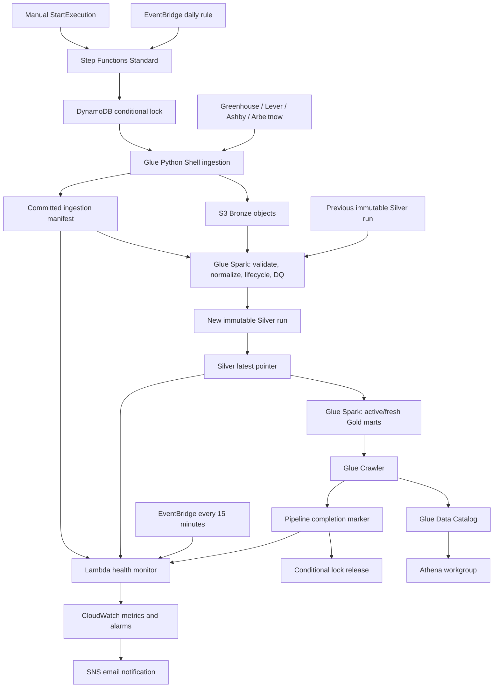

# System architecture

This document describes the current design and its invariants. Deployment commands and incident
procedures belong in [operations.md](operations.md); monitoring thresholds and alarm response
belong in [monitoring.md](monitoring.md).

## Goals and boundaries

The system collects a configured sample of public job boards, turns source-specific payloads into
traceable lifecycle records, and publishes fresh analytical marts. It is designed for one daily
writer, low operational overhead, and serverless query access.

The source catalog is not the entire job market. Role families are title-based classifications,
and remote status reflects source metadata. The system currently serves data through Athena; the
experimental Streamlit client is outside the active delivery scope.

## System context


```mermaid
flowchart LR
    USER[Data consumer] --> ATHENA[Amazon Athena]
    APIS[Public job APIs] --> PIPELINE[AWS data pipeline]
    PIPELINE --> LAKE[Amazon S3 data lake]
    LAKE --> ATHENA
    PIPELINE --> OBS[CloudWatch and SNS]
    OPERATOR[Operator] --> PIPELINE
    OBS --> OPERATOR
```

## Container and data flow


```mermaid
flowchart TD
    SCHEDULE[EventBridge daily rule] --> SFN[Step Functions Standard]
    MANUAL[Manual StartExecution] --> SFN
    SFN --> LOCK[DynamoDB conditional lock]
    LOCK --> INGEST[Glue Python Shell ingestion]
    ATS[Greenhouse / Lever / Ashby / Arbeitnow] --> INGEST
    INGEST --> BRONZE[S3 Bronze objects]
    INGEST --> MANIFEST[Committed ingestion manifest]
    BRONZE --> SILVER[Glue Spark: validate, normalize, lifecycle, DQ]
    MANIFEST --> SILVER
    PREVIOUS[Previous immutable Silver run] --> SILVER
    SILVER --> SILVER_RUN[New immutable Silver run]
    SILVER_RUN --> SILVER_STATE[Silver latest pointer]
    SILVER_STATE --> GOLD[Glue Spark: active/fresh Gold marts]
    GOLD --> CRAWLER[Glue Crawler]
    CRAWLER --> CATALOG[Glue Data Catalog]
    CATALOG --> ATHENA[Athena workgroup]
    CRAWLER --> COMPLETE[Pipeline completion marker]
    COMPLETE --> RELEASE[Conditional lock release]

    MONITOR_SCHEDULE[EventBridge every 15 minutes] --> MONITOR[Lambda health monitor]
    MANIFEST --> MONITOR
    SILVER_STATE --> MONITOR
    COMPLETE --> MONITOR
    MONITOR --> METRICS[CloudWatch metrics and alarms]
    METRICS --> SNS[SNS email notification]
```

The state machine is the only authorized production write path. A run identifier and the UTC date
of the execution are fixed at workflow start and passed to every stage.

## Component responsibilities

| Component | Single responsibility |
| --- | --- |
| EventBridge pipeline rule | Start one scheduled state-machine execution each day |
| Step Functions | Coordinate the run, handle failures, and publish completion only after success |
| DynamoDB lock | Serialize writers across the entire workflow |
| Glue Python Shell | Fetch and canonicalize source records and commit the run manifest |
| S3 lake | Store Bronze, Silver, Gold, quality, and control/state objects |
| Glue Bronze-to-Silver | Validate the run, reconcile lifecycle, and enforce data quality |
| Glue Silver-to-Gold | Select active/fresh records and build analytical marts |
| Glue Crawler and Catalog | Register the current Gold schema and partitions |
| Athena | Provide serverless SQL access with a per-query scan limit |
| Lambda health monitor | Independently evaluate publication freshness and source coverage |
| CloudWatch and SNS | Detect execution/health failures and notify an operator |
| Terraform | Define infrastructure, policies, schedules, uploads, and cost controls |

## Run contract

Every production execution has one immutable `run_id`. Ingestion writes one canonical newline-
delimited JSON object for each successful board and commits the manifest only after those objects
exist.

```text
bronze/run_id=<run>/source=<source>/board=<token>/jobs.json
control/ingestion/run_id=<run>/manifest.json
silver/runs/<run>/jobs/*.parquet
quality/silver_jobs/<run>/
state/silver/latest.json
gold/<mart>/snapshot_date=<utc-date>/*.parquet
state/pipeline/latest.json
```

The manifest distinguishes four operational facts:

- a successful board with records;
- a successful empty board;
- a failed board;
- a successful but incomplete board, such as capped pagination.

At least 80% of configured boards and at least one posting are required by default. Silver reads
only objects named by the committed manifest and rejects stale, mismatched, malformed, or
uncommitted input. It never scans accumulated Bronze and relabels old observations as current.

## Posting identity and lifecycle

`job_id` is the lowercase SHA-256 of `source|board_token|source_job_id`. Including the board avoids
collisions when different employers reuse an internal source ID. `dedup_hash` is derived from
normalized company, title, and location and is used for cross-source content deduplication in
Gold.

| Observation | Silver state | Gold eligibility |
| --- | --- | --- |
| Seen in the current run | Preserve `first_seen_at`, update `last_seen_at`, active | Included while fresh |
| Missing from a successful complete board | Inactive: `absent_from_complete_board` | Excluded |
| Board failed, was removed, or was incomplete | Preserve last observation: `board_unverified` | Included only inside the freshness window |
| Not observed for seven days | Inactive: `stale_observation` | Excluded |
| Previously inactive posting returns | Reactivate and preserve original first-seen time | Included while fresh |

Failed and incomplete boards never advance `last_seen_at` and do not immediately close earlier
postings. A successful empty board can close its earlier postings because the empty result is a
complete observation.

## Commit and publication model

Silver writes an immutable run, persists the data-quality result, and then advances
`state/silver/latest.json`. Gold reads that exact committed run and replaces only the requested
UTC `snapshot_date` partition, including when output is empty.

Publication across the three Gold marts is not transactional. The crawler must report a successful
crawl belonging to the current execution before `state/pipeline/latest.json` is written. Consumers
must validate matching Silver and pipeline run IDs plus wall-clock freshness before treating the
latest partition as complete.

The date boundary is UTC. For example, a run at 01:00 on 17 September in UTC+7 starts at 18:00 on
16 September UTC and therefore publishes `snapshot_date=2026-09-16`.

## Gold data products

| Mart | Grain | Use |
| --- | --- | --- |
| `fact_job_posting` | One active, fresh, content-unique posting | Inspect jobs, employers, locations, remote state, and application URLs |
| `demand_by_role` | One configured role family per snapshot | Compare distinct posting demand |
| `role_opportunity` | One configured role family per snapshot | Rank demand and expose remote share and top employer |

One posting may match more than one title-based role family. These marts describe the configured
source sample and must not be presented as the whole labor market.

## Reliability and failure containment

- A conditional DynamoDB lock prevents overlapping writers.
- Each Glue job also has a concurrency limit.
- Network errors, HTTP 429, and transient 5xx responses are retried with backoff.
- A committed ingestion run can be read again without changing its observation time.
- Silver state advances only after validation, data quality, and Parquet output succeed.
- The crawler is verified by status and start time, not merely by returning to `READY`.
- The workflow has a 90-minute ceiling; Glue stages have independent timeouts.
- Aborted or timed-out external jobs must be confirmed stopped before an orphaned lock is removed.
- The monitor is independent of the pipeline and treats a missing health signal as a failure.

## Security boundaries

- Lake, script, and Athena-result buckets are private and encrypted at rest.
- AWS services assume runtime IAM roles; no application access key is stored in the repository.
- Ingestion, transformation, orchestration, schedule, and monitoring permissions are separated by
  role or responsibility.
- The health monitor can read control metadata, write its own logs, and publish project metrics;
  it cannot mutate the lake or start a pipeline execution.
- Athena uses an enforced workgroup result location and a 10 GiB scan cutoff.

Security controls are defined mainly in `infra/s3.tf`, `infra/iam.tf`, `infra/ingestion.tf`,
`infra/schedule.tf`, `infra/monitoring.tf`, and `infra/athena.tf`.

## Storage lifecycle

| Data | Default retention | Reason |
| --- | --- | --- |
| Bronze and ingestion manifests | 30 days | Support replay/audit while bounding raw storage |
| Quality results | 90 days | Retain operational evidence longer than raw payloads |
| Athena results | 7 days | Query output is reproducible |
| Glue temporary data | 7 days | Remove abandoned transient data |
| Silver, Gold, and state | No automatic expiration | Preserve lifecycle and historical analytical state |

## Design decisions and trade-offs

- **S3 instead of an always-on database:** durable, inexpensive storage fits daily batch volume;
  Athena supplies query access without a cluster.
- **Glue Python Shell for ingestion:** API collection is lightweight and does not justify Spark.
- **Glue Spark for lifecycle transforms:** the implementation uses DataFrame operations, Parquet,
  and Glue Data Quality while remaining managed.
- **Step Functions instead of a scheduler-only chain:** the workflow needs ownership, waits,
  retries, crawl verification, and failure cleanup across AWS services.
- **DynamoDB lock instead of a time-based lock:** a TTL could expire while an external Glue task
  still writes, allowing corruption through concurrent runs.
- **Daily schedule:** it balances freshness with Glue cost for this portfolio-scale source set.
- **Athena instead of Redshift or MWAA:** current scale does not justify warehouse or Airflow
  infrastructure and operating cost.
- **Separate health monitor:** successful orchestration alone does not prove fresh, internally
  consistent, or sufficiently covered data.

## Infrastructure map

| Concern | Terraform definition |
| --- | --- |
| Storage, encryption, and lifecycle | `infra/s3.tf` |
| Ingestion job, source catalog, and lock | `infra/ingestion.tf` |
| Spark jobs, database, and crawler | `infra/glue.tf` |
| Script uploads and shared contract | `infra/scripts_upload.tf` |
| Orchestration and completion marker | `infra/stepfunctions.tf` |
| Runtime permissions | `infra/iam.tf`, `infra/ingestion.tf`, `infra/schedule.tf`, `infra/monitoring.tf` |
| Daily schedule | `infra/schedule.tf` |
| Monitoring and notification | `infra/monitoring.tf` |
| Athena and saved queries | `infra/athena.tf` |
| Budget guardrail | `infra/budget.tf` |

## Known limitations

- Arbeitnow pagination is capped at two pages and is marked incomplete when more pages exist.
- Gold marts are not committed through a single storage transaction.
- Role classification uses title rules rather than a trained semantic classifier.
- Remote status depends on source metadata quality.
- Lifecycle history from the current method begins with the September 2026 migration; earlier
  Gold snapshots used a different accumulated-Bronze method and are not trend-comparable.

See [sample_results.md](sample_results.md) for point-in-time analytical results and their
interpretation limits.
